1. ### **Sign Up Page**

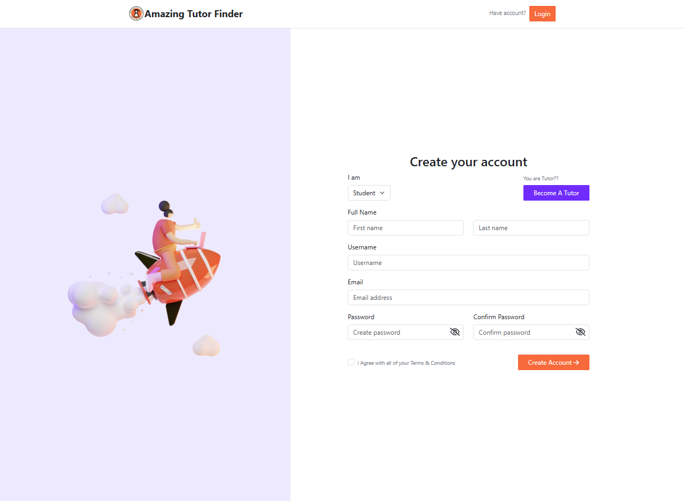

#### Figure 1.1 Sign Up Page

Figure 1.1 is a crucial part of the Main Screen for the system. It is designed to allow new users (students, parents, and tutors) to create an account. This page provides a clear and user-friendly form for entering the required information, including:

| User Role Selection  | The user selects their role (Student, Tutor, Parent). |
| :------------------- | :---------------------------------------------------- |
| Full Name            | The user enters their first and last name.            |
| Username             | A unique username for the user to log in.             |
| Email                | The user's email address.                             |
| Password             | A secure password with confirmation.                  |
| Terms and Conditions | A checkbox to agree to the system's terms.            |

Figure 7.1 serves as an entry point for users to register and gain access to their respective subsystems within the application.

2. ### **Login Page**

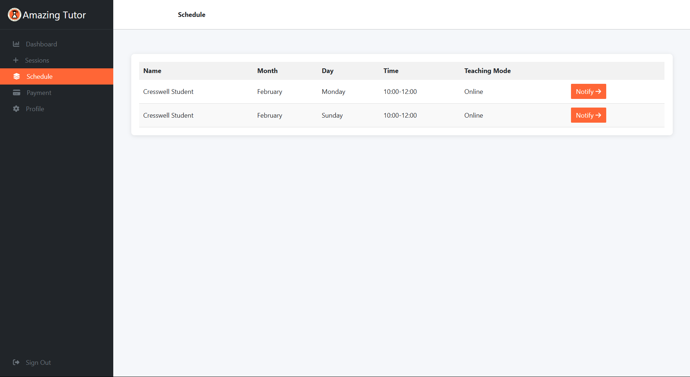

#### Figure 1.2 Login Page

Figure 1.2 is the Login Page of your system. The page is where users (such as tutors, parents, students, or admins) can enter their credentials to access their accounts. Here are the components of the screen based on the provided image:

| Header                  | Displays the system's title ("Amazing Tutor Finder") and a navigation link to the sign-up page for users without accounts.    |
| :---------------------- | :---------------------------------------------------------------------------------------------------------------------------- |
| User Information Fields | **Email** A field for users to input their email address or username. **Password** A field for users to input their password. |
| Remember Me Checkbox    | An option for users to choose whether to stay logged in after closing the browser or session.                                 |
| Forgot Password Link    | A link that users can click if they forget their password, which will guide them to a password recovery page.                 |
| Sign In Button          | A button that, when clicked, submits the entered credentials for verification and logs the user into the system.              |
| Sign Up Link            | A prompt for new users to create an account if they don't have one, leading to the registration page.                         |

Figure 1.2 is part of the Authentication Subsystem and allows access to the system for users who have already registered.

3. ### **Home Page**

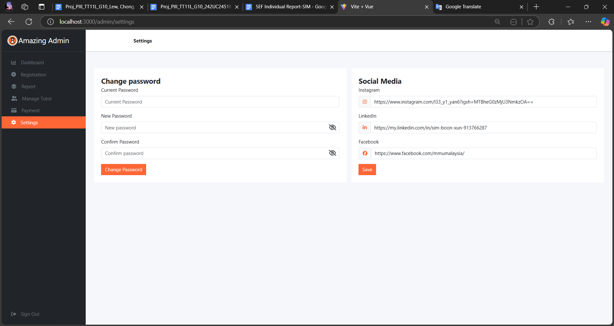

#### Figure 1.3 Home Page (Before Login)

Figure 1.3 displays the homepage of the "Amazing Tutor Finder" website before a user logs in. The page features a welcoming headline, "Learn with experts anytime anywhere," along with a brief mission statement about helping people find the best tutor. It includes navigation options at the top, such as "Home," "Tutor," "About," and "Contact." There's a prominent "Find a tutor" search bar and buttons for users to log in or create an account, making it easy for visitors to access the platform.

4. ## **Tutor Management Subsystem Screens**

4.1. ### **Sign Up As Tutor**

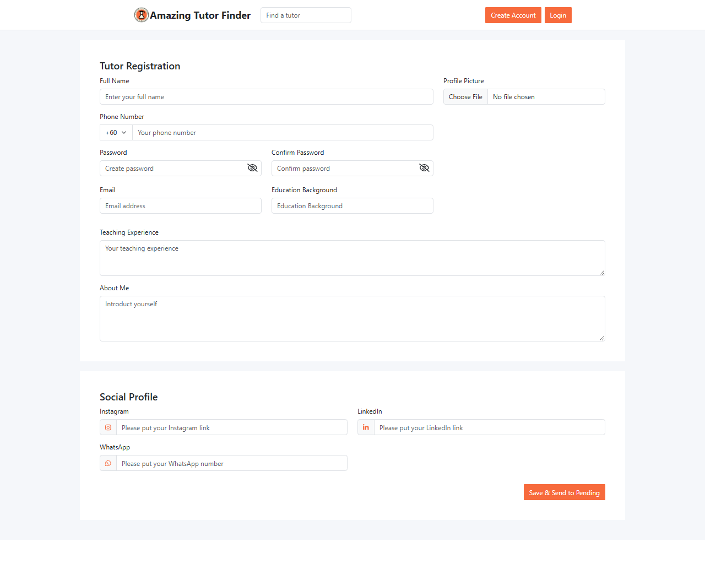

#### Figure 1.4 Sign Up As Tutor Page

As one of the newest tutors to apply for the Amazing Tutor Finder, all you're required to do is enter your full name, phone number, email, and password (confirmation also required) in order to sign yourself up on this page (Figure 1.4). You are also welcome to upload your profile picture and provide general information regarding your educational background, teaching experiences, and further details in the About Me section. There will be a corresponding field to put in your social profiles such as your Instagram, LinkedIn, and WhatsApp accounts to facilitate direct contact with students and parents. ek. After filling in the forms, simply save and send for approval the application as pending, thus ensuring that we continue to welcome only quality tutors in a friendly but professional manner.

4.2. ### **Dashboard Page**

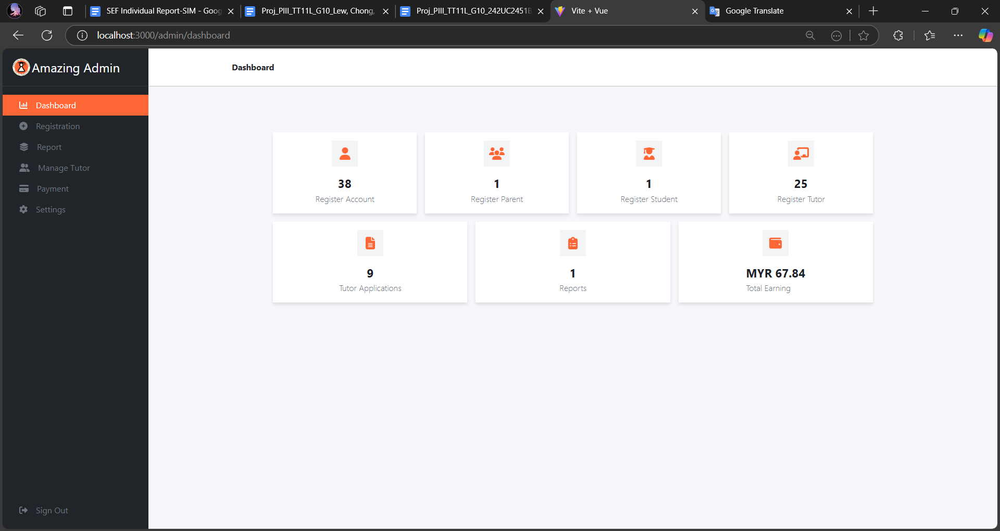

#### Figure 1.5 Dashboard Page

Figure 1.5 provides an overview of a tutor's key activities, including the number of students, total earnings, and online sessions. It features a schedule section displaying upcoming sessions with students, along with an overall rating breakdown based on student feedback. The profile section allows tutors to update their details, while the sidebar navigation offers quick access to sessions, schedules, payments, and profile management. This dashboard helps tutors efficiently manage their workload and track their performance in one centralised view.

4.3. ### **Sessions Page**

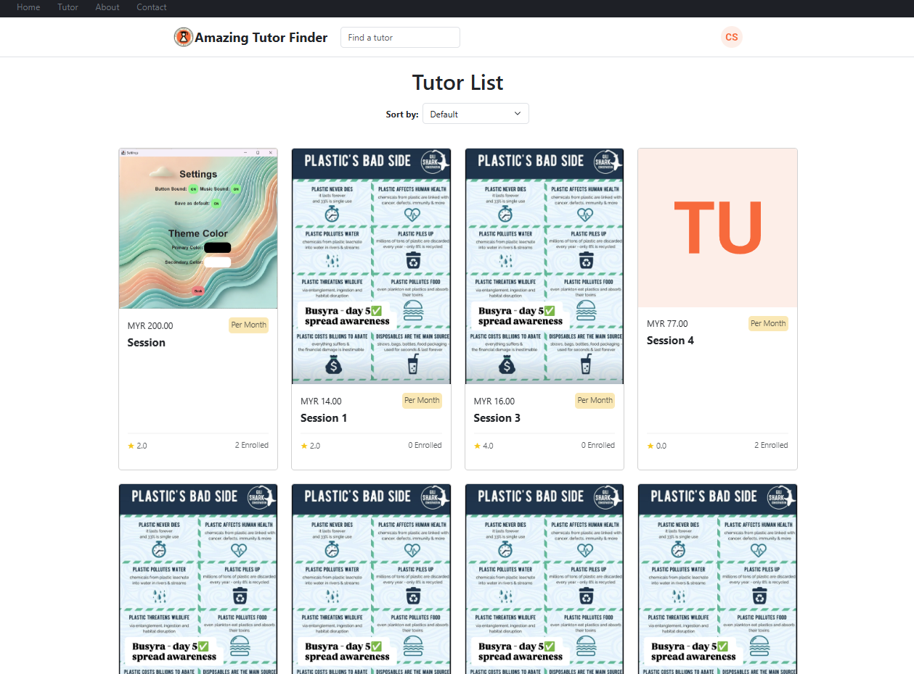

#### Figure 1.6 Sessions Page

Figure 1.6 is a digital platform that enables tutors to create or update their teaching sessions. The functionality of the page allows tutors to input session-related details, including the title, subtitle, designated course language, and the corresponding price per month. Furthermore, tutors can select the session month and specify their available working days. This feature provides a high degree of flexibility in terms of scheduling, and ensures that students can view and book sessions based on tutor availability. The Sessions Page has been designed to have a streamlined interface, with the objective of enabling tutors to manage their session offerings in an efficient manner.

4.4. ### **Schedules Page**

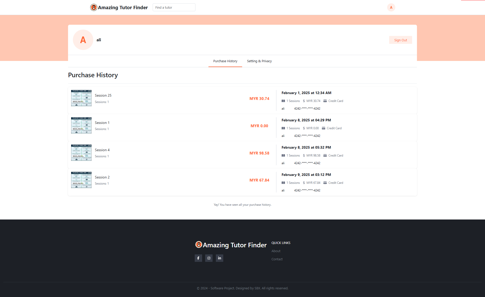

#### Figure 1.7 Schedules Page

Figure 1.7 is a web-based tool that enables tutors to view a list of students who have enrolled in their sessions. It displays key session details, including the student's name, session month, day, time, and teaching mode. The "Notify" button facilitates communication between tutors and students by enabling tutors to send an email notification to students, including a Google Calendar event link. This feature ensures that students can easily add the session to their personal calendars, enhancing the efficiency of the communication process and ensuring students remain informed about their upcoming sessions.

4.5. ### **Payment List Page**

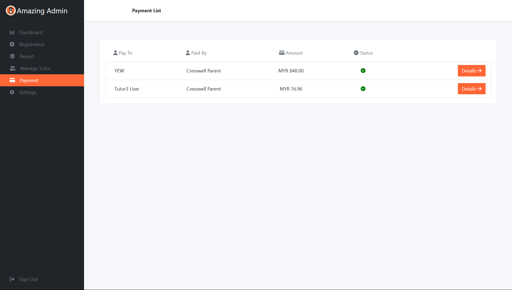

#### Figure 1.8 Payment List Page

Figure 1.8 facilitates the viewing of a list of payments received by tutors for their sessions. The page displays key details such as the payer's name, the amount paid, and the payment status. A "Details" button is available for each payment entry, allowing tutors to navigate to a more detailed view of the selected payment. This ensures transparency and facilitates the tracking of earnings for tutors.

4.6. ### **Payment Details Page**

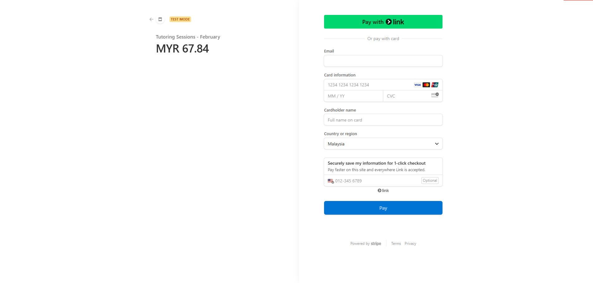

#### Figure 1.9 Payment Details Page

Figure 1.9 offers a thorough overview of a particular payment transaction, encompassing essential details such as the payer's information (parent's name and email address), the student's particulars, the tutor's details, and the scheduled session times. The payment amount, status, and recipient information are also exhibited for transparency purposes. Furthermore, the page incorporates a "Download PDF" button that facilitates the download of a comprehensive payment receipt for archival purposes. A "Back" button enables seamless navigation to the previous page.

4.7. ### **Settings Page**

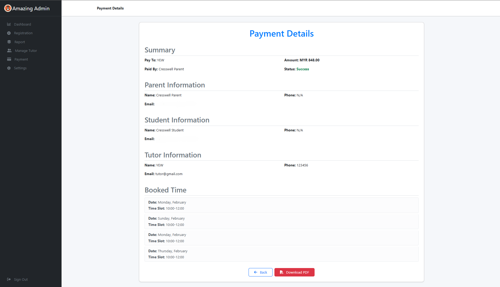

#### Figure 1.10 Settings Page

Figure 1.10 facilitates the management of account security and the updating of social media links by administrators. Located on the left side of the interface is a Change Password section, which enables users to enter their current password, set a new password, and confirm it prior to clicking the "Change Password" button to update their credentials. On the right side of the interface, the Social Media section allows administrators to update links to their Instagram, LinkedIn, and Facebook pages, thereby ensuring flexibility in the maintenance of external connections. The "Save" button located at the bottom of the page enables changes to be stored.

5. ## **Student Management Subsystem Screens**

5.1. ### **Dashboard Page**

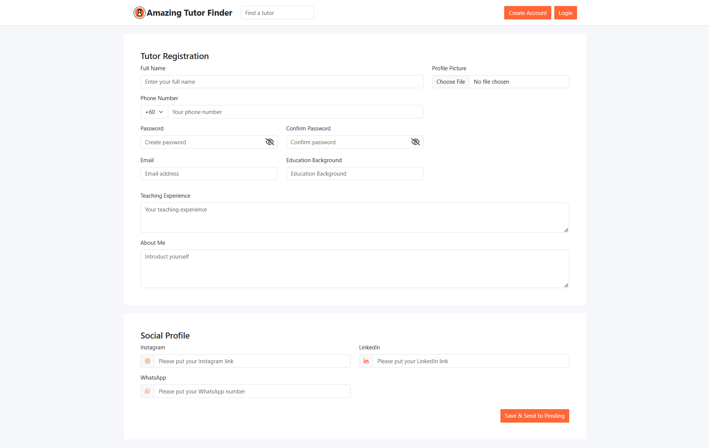

#### Figure 1.11 Dashboard Page

Figure 1.11 shows the homepage after a user has logged in. The design is similar to the pre-login version, but with an updated navigation bar that includes "Create Account" and "Login" options replaced by the user's logged-in status. The page displays a "Tutor Recommended" section with a session and price details, and the user can browse tutors. A settings window is also shown, where users can adjust theme colors and toggle buttons and music sound settings, creating a personalized browsing experience. The "Browse All Tutor" button encourages users to explore available tutors.

5.2. ### **Tutor List Page**

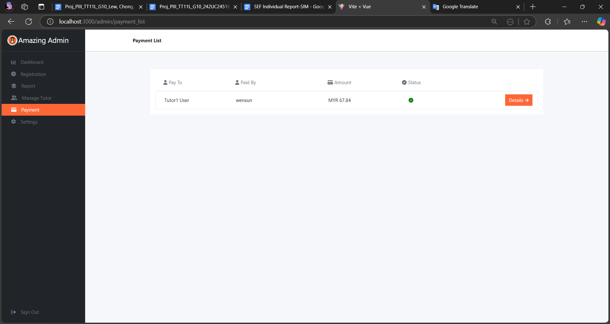

#### Figure 1.12 Tutor List Page

Figure 1.12 displays available tutors, providing an option for students and parents to search and filter based on criteria such as subject, rating, and location. The tutors are shown with their session details, including price and the number of enrolled students. Users can view detailed tutor profiles or choose to book a session directly from this screen. The screen is designed to make it easy for parents and students to browse tutors and manage session bookings. The "Tutor List" section serves as an essential interface for browsing and selecting tutors, making it an important part of the system's core functionalities.

5.3. ### **Tutor Details Page**

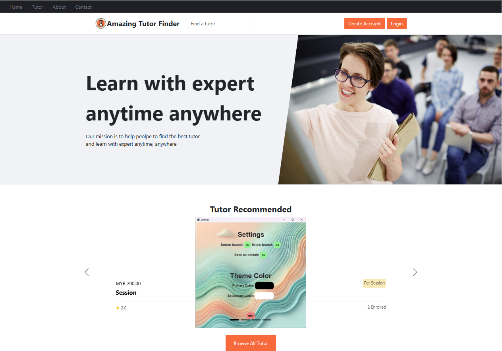

#### Figure 1.13 Tutor Details Page

Figure 1.13 showcases detailed information about a specific tutor, such as their name, teaching experience, contact details, location, and availability. This screen is primarily used by students and parents to learn more about a tutor's qualifications before making a booking. Key features include the option to write a review or report about the tutor, as well as the ability to notify the parent. It also displays the tutor's social media links for easier communication and provides feedback about the tutor's sessions. This screen helps students and parents make informed decisions when choosing tutors for their sessions.  
_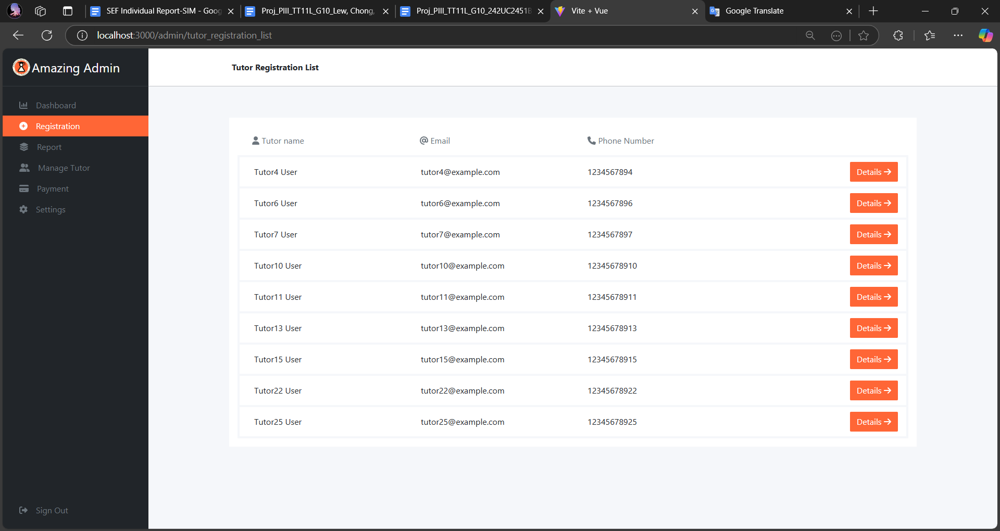

#### Figure 1.14 Review Tutor Pop-Up

Figure 1.14 allows users (parents or students) to provide feedback on a tutor's performance. The modal appears when the user clicks the "Write a Review" button on the tutor's profile page. It includes a rating system where users can select a score from 1 to 5 stars. After rating, the user can write a detailed feedback in the provided text box, giving a description of their experience with the tutor. Once the review is complete, the user can submit it by clicking the "Submit Review" button. This helps provide valuable insights for other students and parents who are considering the tutor for their sessions.  

#### Figure 1.15 Report Tutor Pop-Up

Figure 1.15 allows users (such as parents or students) to report any issues or concerns they may have regarding a tutor. It appears when the user clicks the "Write a Report" button on the tutor's profile page. The modal asks for the "Report to" field (which defaults to the tutor's name) and a "Description" field where users can provide detailed feedback about the issue or situation. Once the description is written, the user can submit the report by clicking the "Submit Report" button. This feature helps the platform maintain quality control and ensure a safe and professional environment for students and tutors.

5.4. ### **Enrolled Tutor Page**

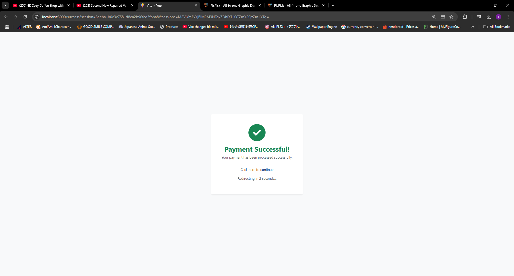

#### Figure 1.16 Enrolled Tutor Page

Figure 1.16 shows the tutors that the student has enrolled in, with their respective session details. Each tutor session is displayed with the tutor's name and teaching schedule, such as Monday and Thursday from 08:00 to 10:00 for one session and Monday and Thursday from 13:00 to 15:00 for another. The student can view a rating for each session along with the number of students enrolled. Additionally, there are options to view more details about each session or leave a review for the tutor, offering an easy interface for managing and interacting with enrolled tutors.

5.5. ### **Settings & Privacy Page**

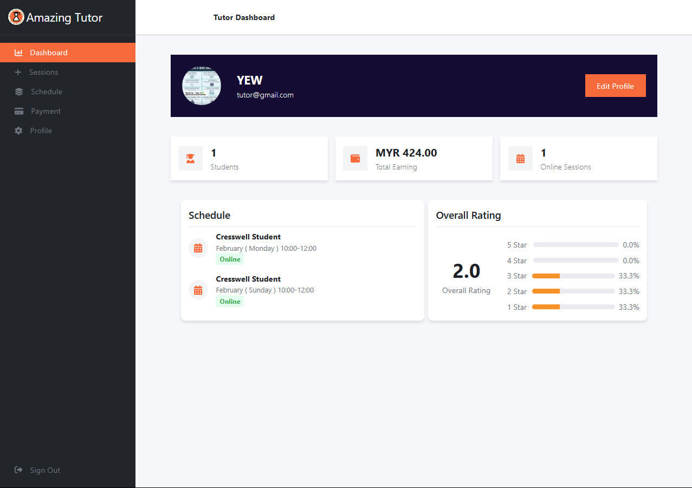

#### Figure 1.17 Settings & Privacy Page

Figure 1.17 allows students to manage their personal information and account settings. It displays editable fields such as the full name, username, and email address, and gives the option to update the profile picture. Students can also change their password by entering the current password and creating a new one. The page includes a section to link the student's parent email address for communication purposes. All changes can be made and saved through the provided edit buttons and options, offering a straightforward interface for students to manage their settings and privacy preferences.

6. ## **Parent Management Subsystem Screens**

6.1. ### **Rate Tutor Page**

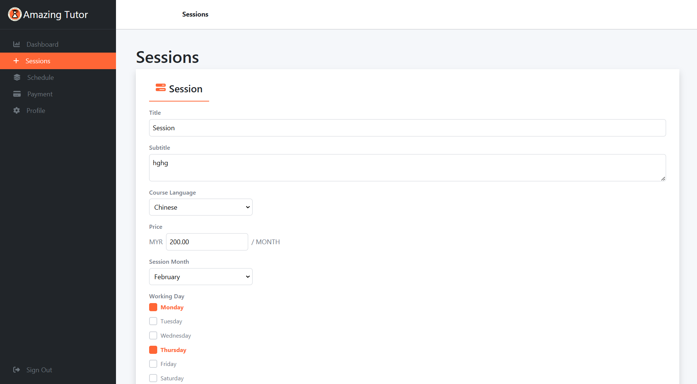

#### Figure 1.18 Rate Tutor Page

Figure 1.18 displays a session booking interface for Tutor2 User on the Amazing Tutor Finder platform. The form allows users to select how many stars they want to rate and parents can give feedback.The interface includes a "Submit Review" button, which will submit the review to the page.

6.2. ### **Report Tutor Page**

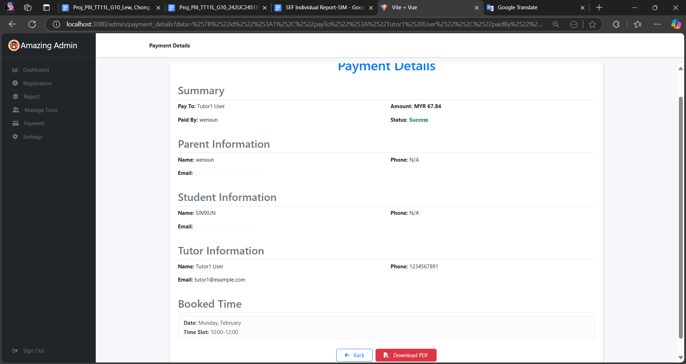

#### Figure 1.19 Report Tutor Page

Figure 1.19 displays a session booking interface for Tutor2 User on the Amazing Tutor Finder platform. The form allows parents to report the tutor if anything goes wrong and parents can write a description of why they reported the tutor. The interface includes a "Submit Review" button, which will submit the review to the page.

6.3. ### **Book Sessions Page**

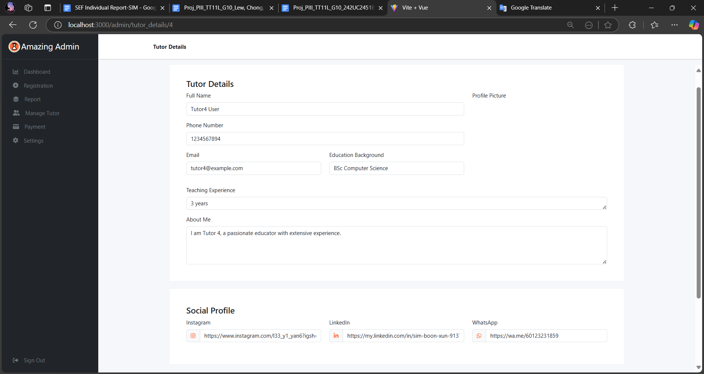

#### Figure 1.20 Book Sessions Page

Figure 1.20 allows parents to book a session for their child with a tutor. The parent selects the child from a dropdown menu, chooses the month and available session time (e.g., Sunday from 08:00 to 10:00), and reviews the order summary, which includes the session cost and platform service charge. The total cost is calculated and displayed, and the parent can proceed to make a payment to confirm the session booking. This page streamlines the process for parents to schedule and pay for tutoring sessions, offering a clear summary of the details.

6.4. ### **Purchase History Page**

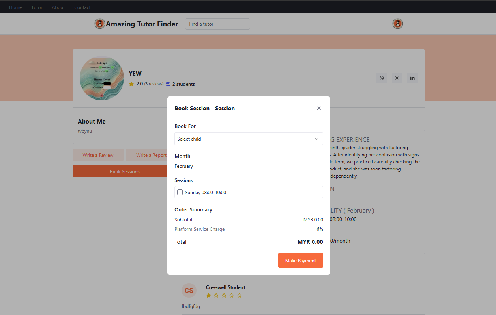

#### Figure 1.21 Purchase History Page

Figure 1.21 provides users with a clear and organized view of their past transactions. It displays a list of purchased tutoring sessions, including session names, number of sessions, and payment details. Each transaction is listed with the amount paid, the date and time of the purchase, and the payment method (e.g., credit card with masked card details). The page ensures users can easily track their spending and review their session history. Additionally, a confirmation message at the bottom notifies users when they have reached the end of their purchase records. The navigation bar allows switching between "Purchase History" and "Settings & Privacy", while a "Sign Out" button ensures secure account management. The footer includes the Amazing Tutor Finder logo, social media icons (Facebook, Instagram, LinkedIn), quick links to the About and Contact pages, and a copyright notice. This page helps users manage their past transactions efficiently while maintaining security and accessibility.

6.5. ### **Setting & Privacy Page**

#### Figure 1.22 Setting & Privacy Page

Figure 1.22 provides users with a secure and convenient way to manage their account details, update security settings, and link child accounts. Users can view and edit their personal information, including their full name, username, and email address, as well as update their profile picture following specific size requirements. To enhance security, the page allows users to change their passwords by entering the current password, a new password, and confirming the new password before submitting the update. Additionally, users can link a child’s email account for monitoring purposes by entering the email address and clicking the “Link” button, with an option to remove linked accounts if needed. Navigation options include switching between the "Purchase History" and "Settings & Privacy" tabs, and a "Sign Out" button ensures a secure logout process. The footer section features the Amazing Tutor Finder logo, social media icons (Facebook, Instagram, LinkedIn), quick links to the About and Contact pages, and a copyright notice. This page is designed to give users full control over their account settings while maintaining security and ease of use.

7. ## **Payment Subsystem Screens**

7.1. ### **Proceed Payment Page**

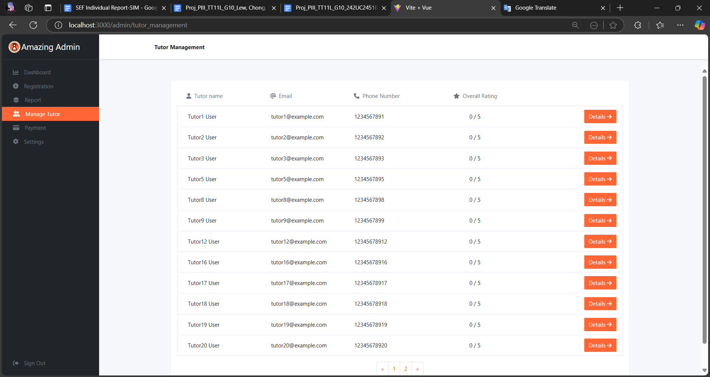

#### Figure 1.23 Proceed Payment Page

Figure 1.23 offers two payment methods: "Pay with Link", a fast checkout option, and manual card entry. Users need to fill in their email, card details (card number, expiration date, CVC), cardholder name, and country/region (set to Malaysia). Additionally, there's an option to securely save payment information for quicker future checkouts. The "Pay" button is located at the bottom to complete the transaction. The checkout page is in test mode, meaning it's likely being used for development or testing purposes rather than real transactions.Forgot Password page on Amazing Tutor Finder provides a simple and secure way for users to reset their passwords if they are unable to log in. To initiate the password reset process, users need to enter their registered email address in the provided field. Upon submission by clicking the "Next" button, a One-Time Password (OTP) will be sent to the entered email address. Users can then use the received OTP to verify their identity and proceed with creating a new password. This feature ensures account security while allowing users to regain access to their accounts efficiently.

7.2. ### **Payment Success Page**

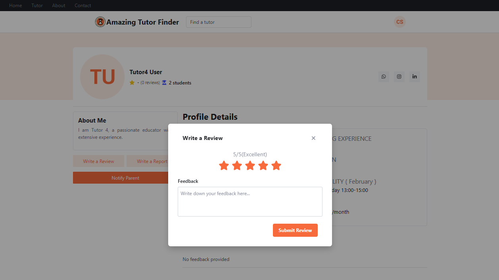

#### Figure 1.24 Payment Success Page

Figure 1.24 shows a "Payment Successful\!" confirmation screen. It indicates that the payment has been processed successfully. There is an option to click to continue, and the page is set to redirect in 5 seconds. The design features a green checkmark, reinforcing the success message.

8. ## **Admin Management Subsystem Screens**

8.1. ### **Dashboard Page**

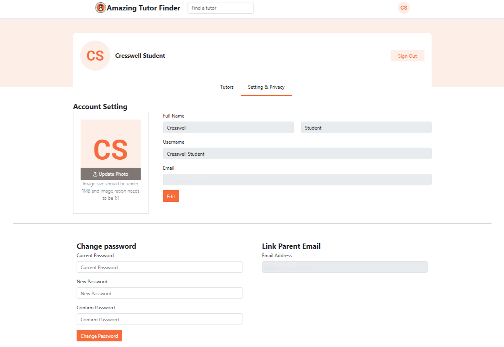

#### Figure 1.25 Dashboard Page

Figure 1.25 presents an overview of key system metrics in a structured and visually organized manner. The layout consists of a left-side navigation panel and a main content area displaying statistical data. The navigation panel, styled in dark mode, includes options such as Dashboard, Registration, Report, Manage Tutor, Payment, and Settings, allowing administrators to access different functionalities efficiently.

In the main content section, the Dashboard header is prominently displayed, followed by multiple information cards summarizing system activity. These include Registered Accounts , Registered Parents , Registered Students , and Registered Tutors , providing an overview of user engagement. Additionally, there are metrics for Tutor Applications , Reports , and Total Earnings , giving the administrator insight into tutor approvals, system complaints, and platform revenue. Each data card is designed with an icon and a concise description, making it easy to interpret.

Overall, this dashboard serves as a central hub for administrators to monitor user activity, manage tutor applications, track earnings, and handle reports efficiently.

8.2. ### **Tutor Registration List Page**

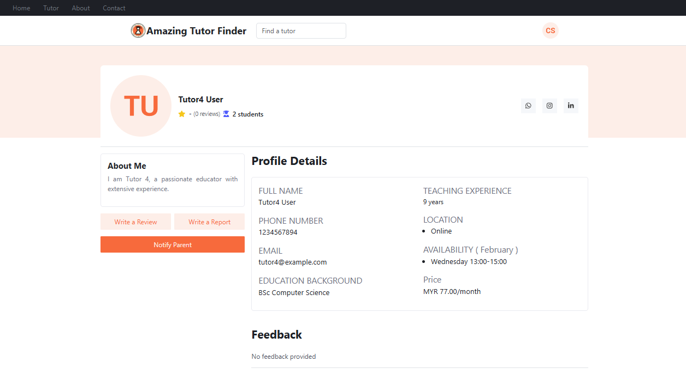

#### Figure 1.26 Tutor Registration List

Figure 1.26 displays a structured table containing details of registered tutors awaiting approval. The table includes three main columns: Tutor Name, Email, and Phone Number, listing multiple tutor entries with their respective contact information. Each row represents an individual tutor, and next to each entry is an orange "Details" button, allowing the administrator to review more information about the tutor's application. This layout provides a clear and organized view for managing tutor registrations efficiently.

8.3. ### **Tutor Registration Details Page**

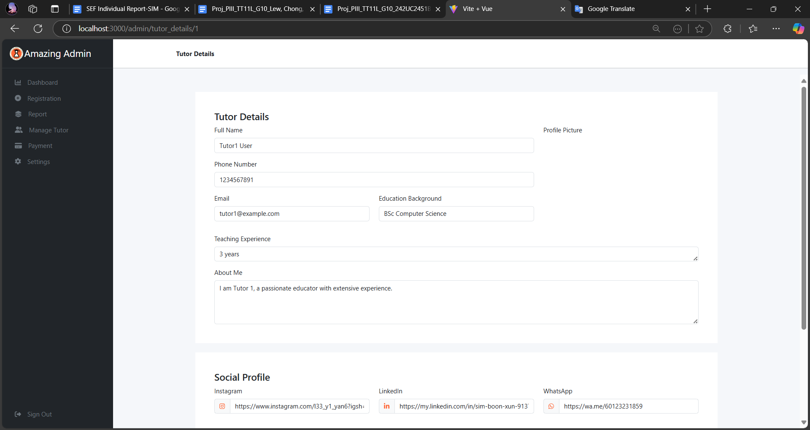

#### Figure 1.27 Tutor Registration Details

Figure 1.27 presents a structured form displaying key information about a tutor's profile. It includes fields for the full name, phone number, email, education background, and teaching experience, allowing administrators to review and verify tutor credentials. An "About Me" section provides a brief description of the tutor's background and expertise. Additionally, a Social Profile section at the bottom contains links to the tutor’s external platforms, such as Instagram, LinkedIn, and WhatsApp, facilitating further contact and verification.the tutor registration detail page, this page includes a button allowing the administrator to change the tutor’s account status to "Approve" or “Reject” This layout ensures efficient management and evaluation of tutor applications.

8.4. ### **Tutor Management Lists Page**

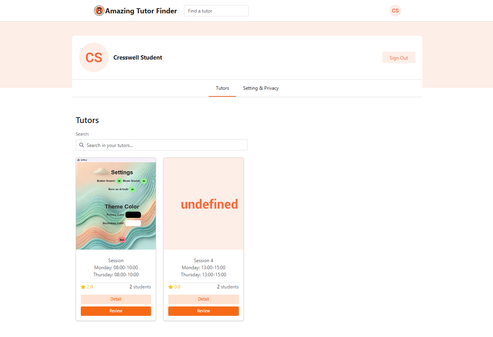

#### Figure 1.28 Tutor Management Lists

Figure 1.28 displays a list of tutors who have already been approved. Unlike the Tutor Registration List, which shows pending tutor applications, this page includes an additional Overall Rating column, providing insight into each tutor’s performance based on student feedback. The table contains columns for the tutor’s name, email, phone number, and their rating out of five stars, allowing administrators to monitor tutor quality. Each row has a "Details" button, enabling the admin to access a tutor’s full profile and manage their status if necessary. At the bottom, pagination controls allow navigation between multiple pages of tutor records, ensuring efficient management of large tutor lists.

8.5. ### **Tutor Management Details Page**

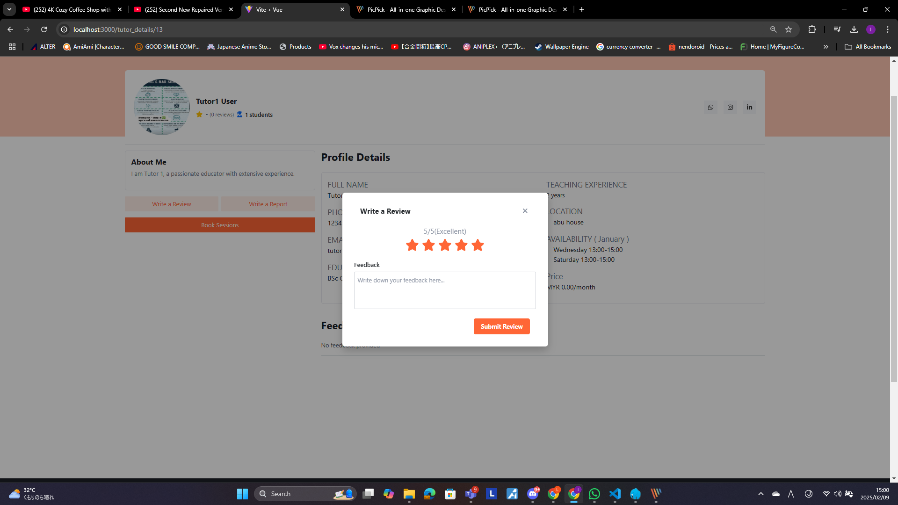

#### Figure 1.29 Tutor Management Details

Figure 1.29 provides a comprehensive view of their profile. It includes fields displaying the tutor's full name, phone number, email, education background, and teaching experience, along with a brief "About Me" section describing their expertise. Below, a Social Profile section contains links to the tutor's Instagram, LinkedIn, and WhatsApp, offering additional contact options. Unlike the tutor detail review page, this page includes a button allowing the administrator to change the tutor’s account status to "Rejected", giving them the ability to revoke approval if necessary. This feature ensures that administrators can manage tutor eligibility even after initial approval.

8.6. ### **Report Management Lists Page**

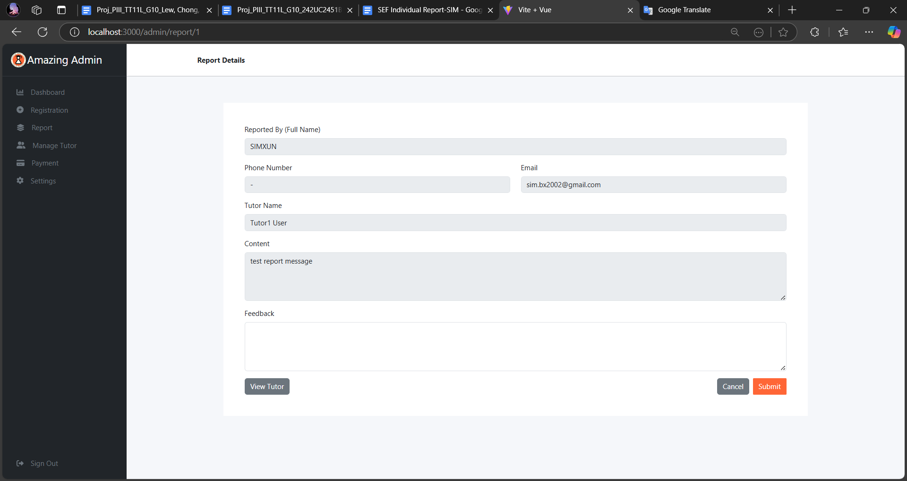

#### Figure 1.30 Report List

Figure 1.30 provides an overview of user-submitted reports, allowing administrators to review and manage complaints. The table consists of columns displaying the report by user, report time, and title of the report. Each row contains a "Details" button, enabling administrators to access a more detailed view of the report for further investigation. This page ensures that all submitted reports are logged and accessible for review, helping administrators take appropriate action when necessary.

8.7. ### **Report Details Page**

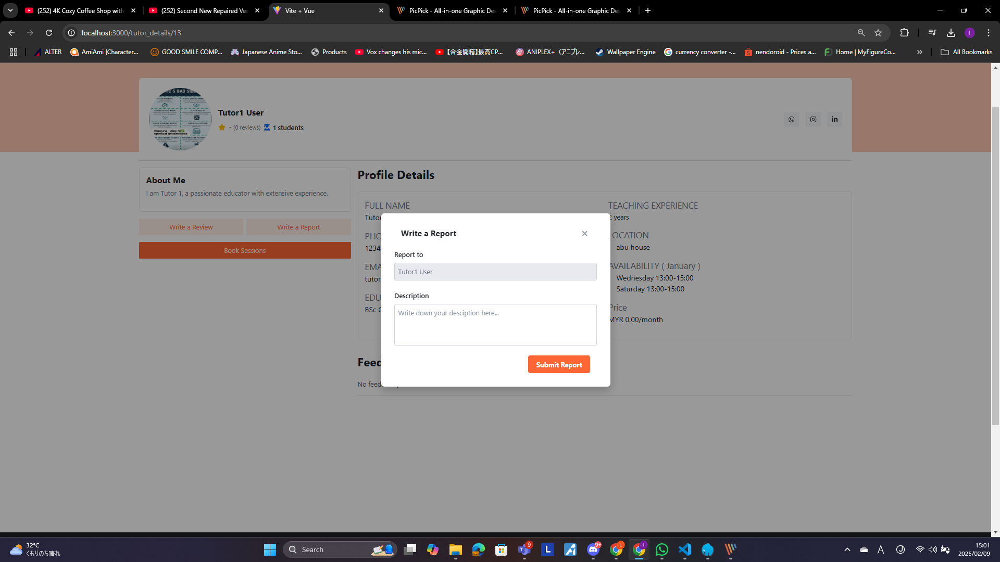

#### Figure 1.31 Report Details

Figure 1.31 provides an in-depth view of a submitted report, allowing administrators to review and take action. It displays the reported user's full name, email, and the tutor associated with the report, along with the content of the complaint. There is a feedback input field where the administrator can add remarks or a resolution before submitting a response. Additionally, a "View Tutor" button is available, enabling the admin to directly access the tutor’s profile for further investigation. At the bottom, there are "Cancel" and "Submit" buttons, allowing the admin to either discard or finalize the feedback. This page ensures efficient management and resolution of reported issues.

8.8. ### **Payment Lists Page**

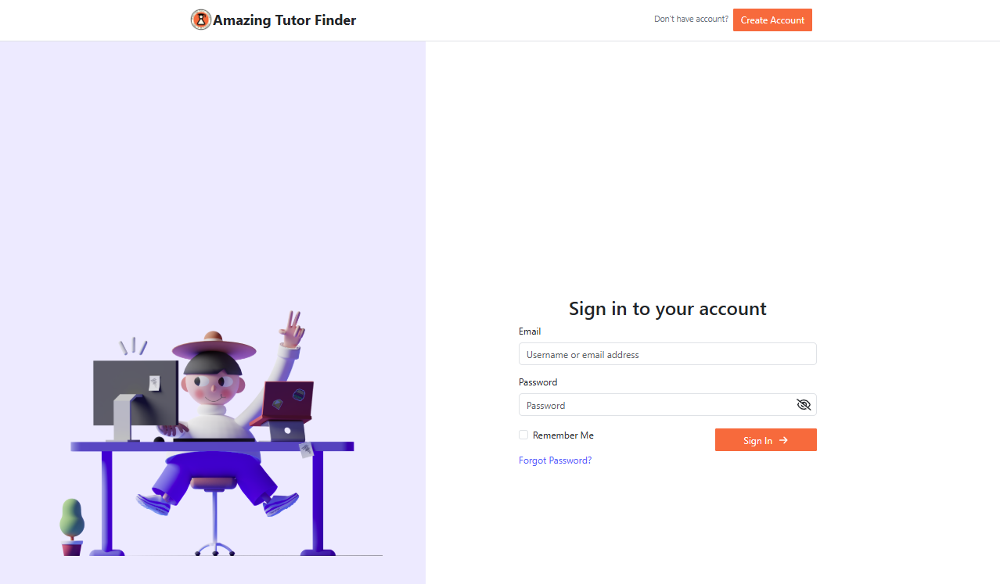

#### Figure 1.32 Payment Lists

Figure 1.32 provides an overview of completed transactions within the system. It displays key details, including the recipient (Pay To), payer (Paid By), transaction amount, and payment status. The status is visually indicated with a checkmark for successful payments. Each row has a "Details" button that allows administrators to review more information about a specific transaction. This page helps the admin monitor and manage payments efficiently, ensuring that tutors receive their earnings and transactions are properly recorded.

8.9. ### **Payment Details Page**

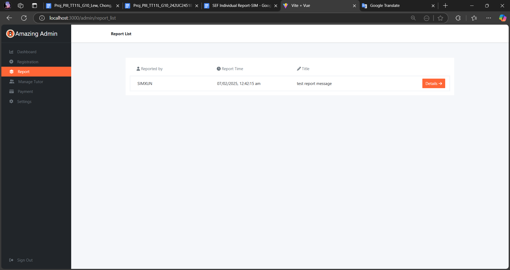

#### Figure 1.33 Payment Details

Figure 1.33 provides a comprehensive breakdown of a completed transaction. At the top, the Summary section displays the recipient (Pay To), payer (Paid By), amount, and transaction status, ensuring clarity on the payment's success. Below, detailed sections for Parent Information, Student Information, and Tutor Information list the associated users along with their contact details. The Booked Time section specifies the date and time slot of the session, confirming the service for which the payment was made. At the bottom, there are two action buttons: "Back" to return to the previous page and "Download PDF" to generate a payment receipt. This page ensures that administrators have full visibility into transaction details for verification and record-keeping.

8.10. ### **Settings Page**

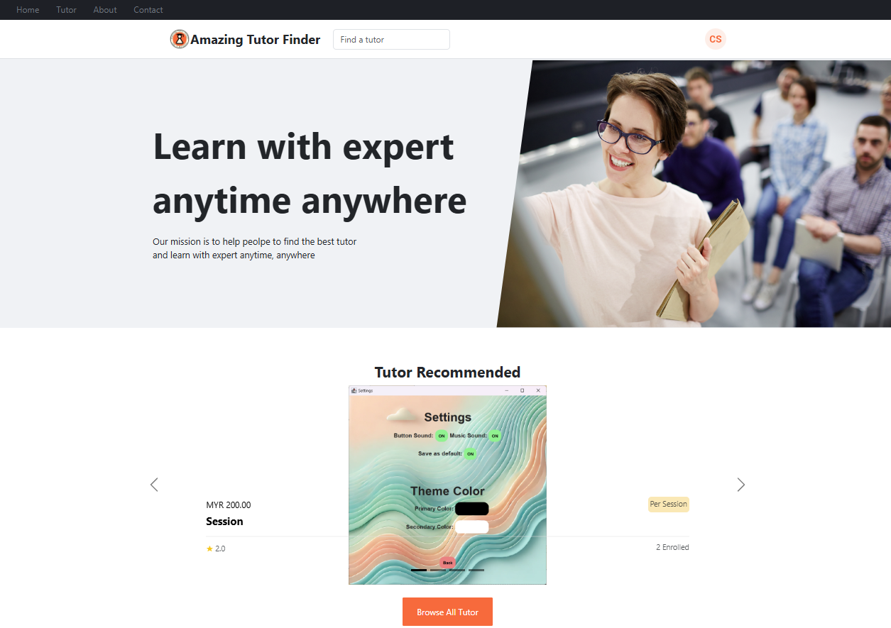

#### Figure 1.34 Settings

Figure 1.34 provides administrators with options to manage account security and platform social media links. On the left side, there is a Change Password section with input fields for the current password, new password, and confirmation password, along with a toggle visibility option for secure entry. Below the inputs, a "Change Password" button allows the administrator to update their credentials. On the right side, the Social Media section contains input fields for Instagram, LinkedIn, and Facebook links, which can be modified and saved using the "Save" button. This page ensures that administrators can maintain account security while managing platform-related social media connections.
